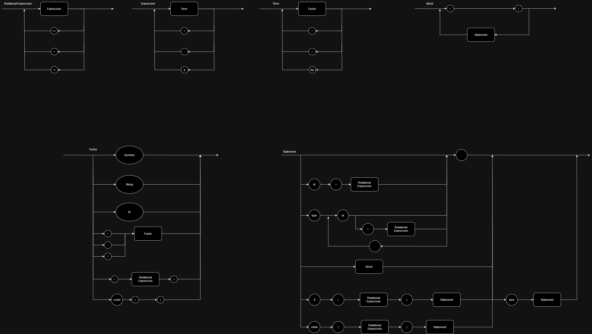

# Compilador

Ebnf:

BLOCK = "{", { STATEMENT }, "}";

STATEMENT = ( λ | ASSIGNMENT | PRINTF | IF_STATEMENT | WHILE_STATEMENT | BLOCK | DECLARATION | ";") ;

ASSIGNMENT = IDENTIFIER, "=", RELATIONAL_EXPRESSION, ";";

DECLARATION = TYPE, IDENTIFIER_DECL, ";" ;

IDENTIFIER_DECL = IDENTIFIER, [ "=", RELATIONAL_EXPRESSION ], { ",", IDENTIFIER, [ "=", RELATIONAL_EXPRESSION ] } ;

PRINTF = "printf", "(", RELATIONAL_EXPRESSION, ")", ";" ;

SCANF = "scanf", "(", ")" ;

IF_STATEMENT = "if", "(", RELATIONAL_EXPRESSION, ")", STATEMENT, [ "else", STATEMENT ] ;

WHILE_STATEMENT = "while", "(", RELATIONAL_EXPRESSION, ")", STATEMENT ;

EXPRESSION = TERM, { ("||" | "+","-"), TERM } ;

RELATIONAL_EXPRESSION = EXPRESSION, { ("==" | "<", ">"), EXPRESSION } ;

TERM = FACTOR, { ("*" | "/" | "&&"), FACTOR } ;

FACTOR = (("+" | "-" | "!"), FACTOR) | NUMBER | "(", RELATIONAL_EXPRESSION, ")" | IDENTIFIER | SCANF | STRING ;

IDENTIFIER = LETTER, { LETTER | DIGIT | "_" } ;

NUMBER = DIGIT, { DIGIT } ;

STRING = LETTER, {CHARACTER};

LETTER = ( a | ... | z | A | ... | Z ) ;

DIGIT = ( 0 | 1 | 2 | 3 | 4 | 5 | 6 | 7 | 8 | 9 ) ;

CHARACTER = LETTER | DIGIT | SPECIAL_CHARACTER ;

SPECIAL_CHARACTER = ( " " | "!" | "@" | "#" | "$" | "%" | "^" | "&" | "*" | "(" | ")" | "-" | "_" | "+" | "=" | "{" | "}" | "[" | "]" | ":" | ";" | "'" | "<" | ">" | "," | "." | "?" | "/" | "\\" | "|" ) ;

TYPE = ("INT" | "STR");

